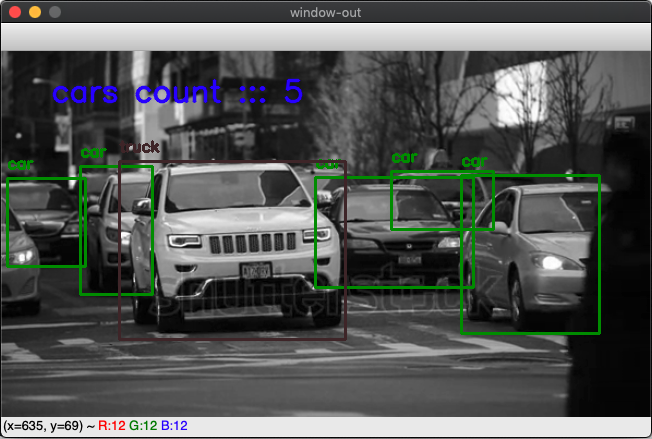

# Opencv Cars Counter

# How to Run

```
$ cd path/to/project/
$ virtualenv -p python3.6 venv 
$ source venv/bin/activate
$ pip install -r requirements.txt
$ python main.py -v video/video03.webm
```


